# 🏢 Gestionnaire d'Employés

Une application Java pour gérer les employés d'une entreprise en utilisant la **programmation orientée objet (POO)**.

## 🚀 Fonctionnalités

- 📌 Ajouter un employé
- ✏️ Modifier les informations d’un employé
- ❌ Supprimer un employé
- 📜 Afficher la liste des employés
- 🔍 Rechercher un employé par nom ou poste
- 💰 Calculer la masse salariale totale
- 📊 Trier les employés par salaire (croissant/décroissant)

## 🛠️ Technologies utilisées

- **Java** (JDK 11 ou supérieur)
- **Collections Java (Array, List)**
- **Scanner pour les entrées utilisateur**
- **Git/GitHub pour le versioning**

## 📦 Installation

1. **Cloner le projet**
   ```bash
   git clone https://github.com/utilisateur/nom-du-repo.git
   cd nom-du-repo


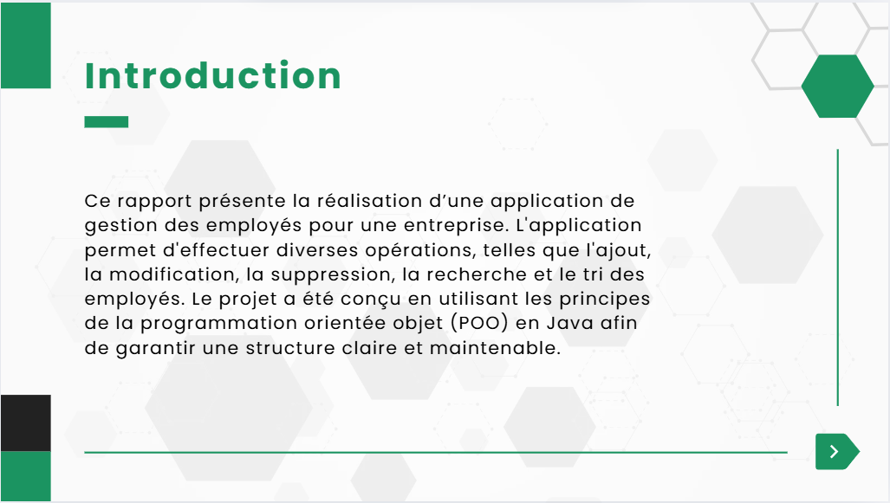
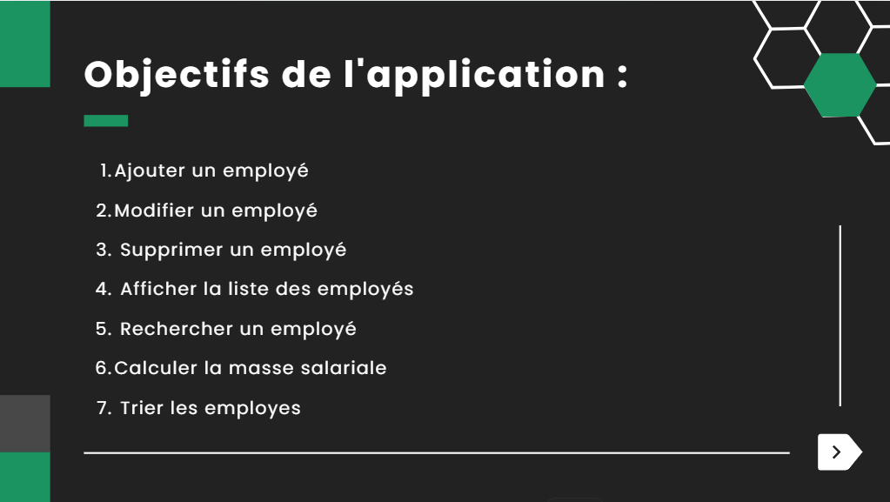
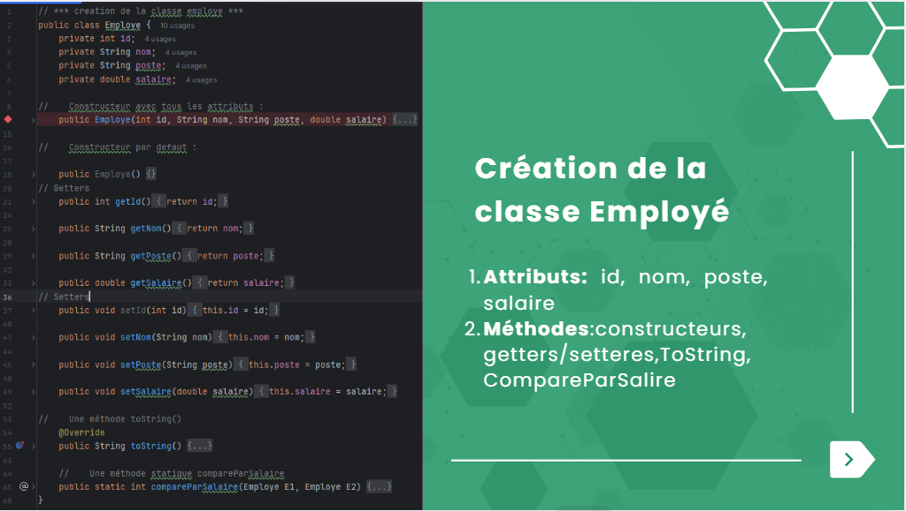
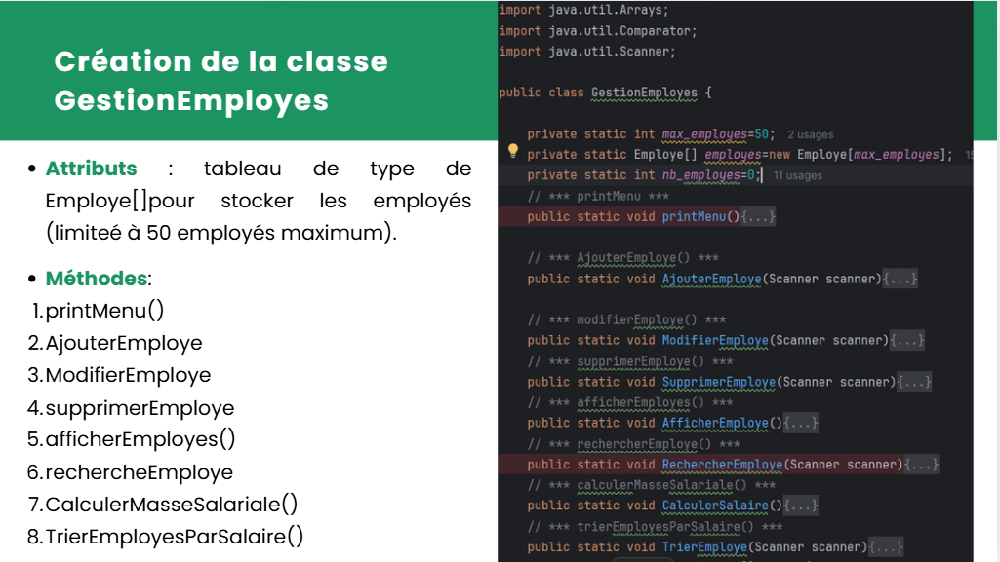
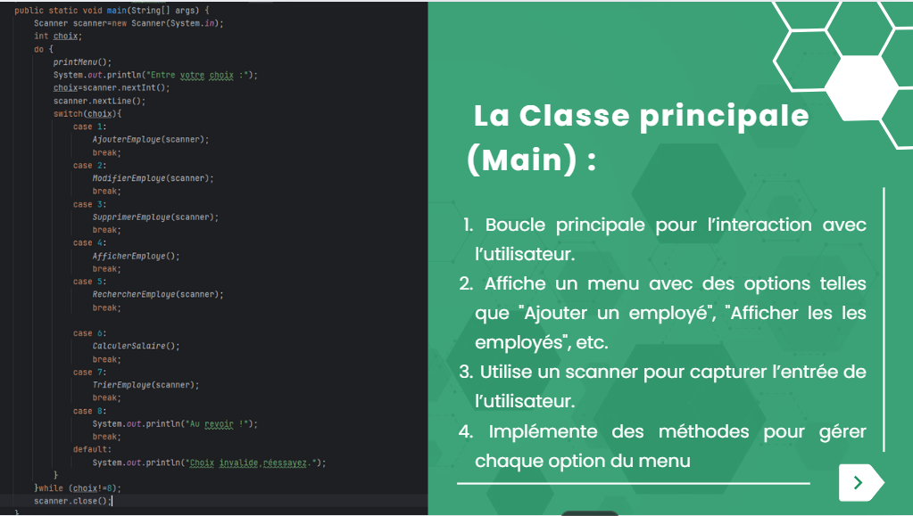
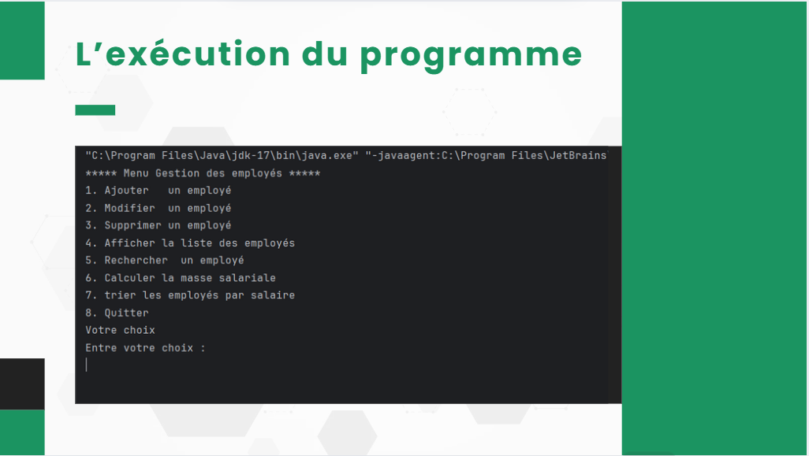
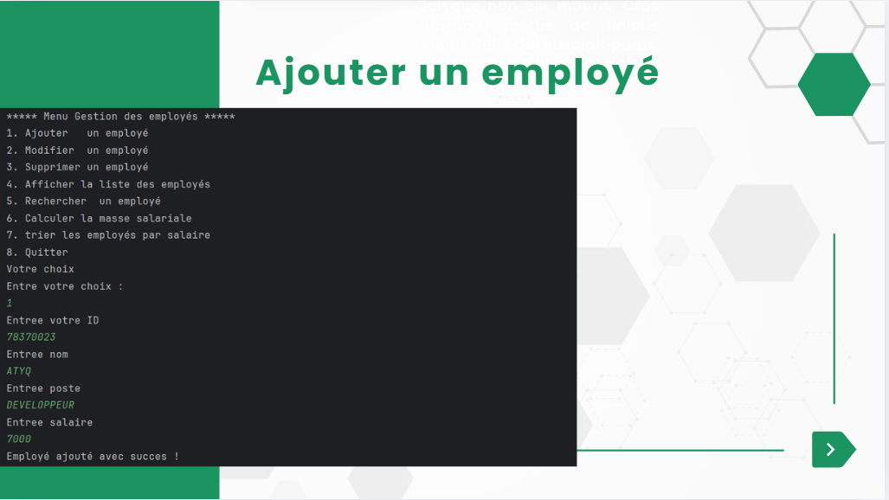
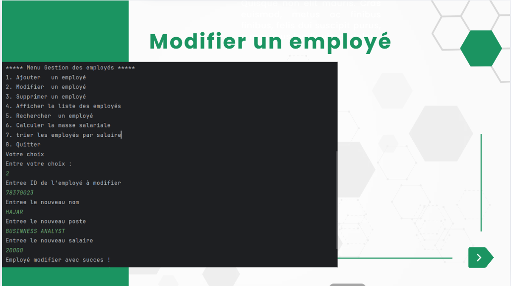
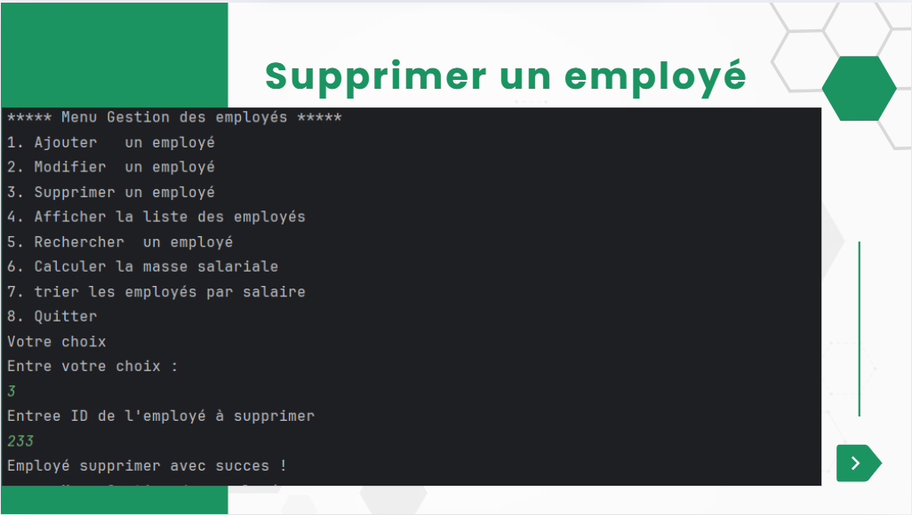
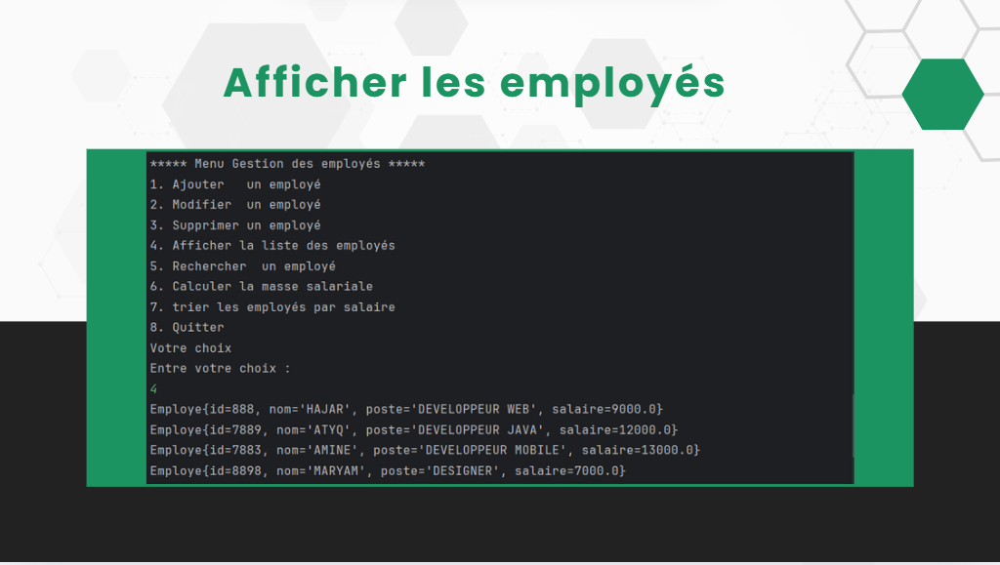
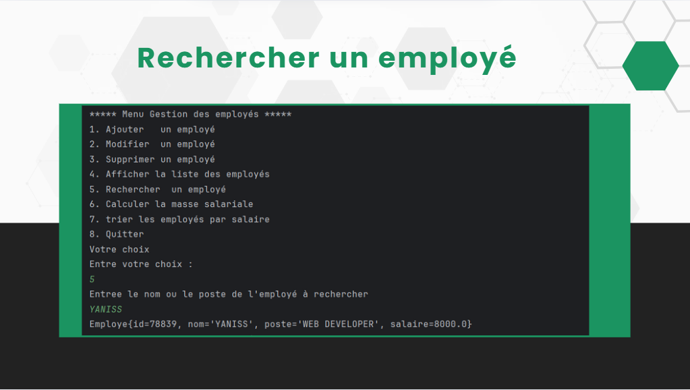
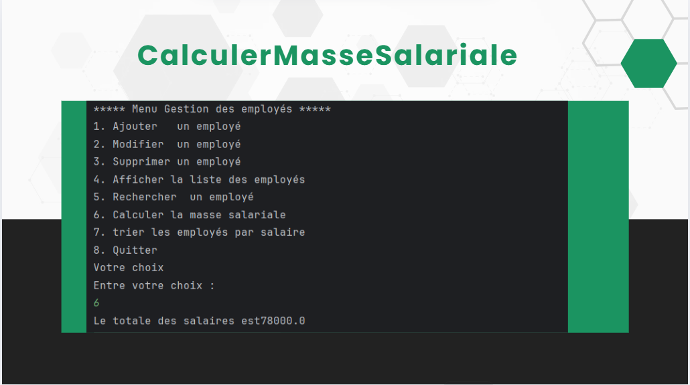
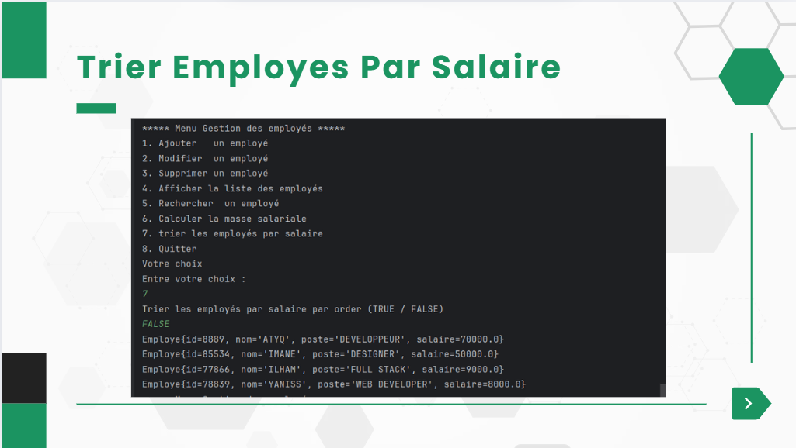

